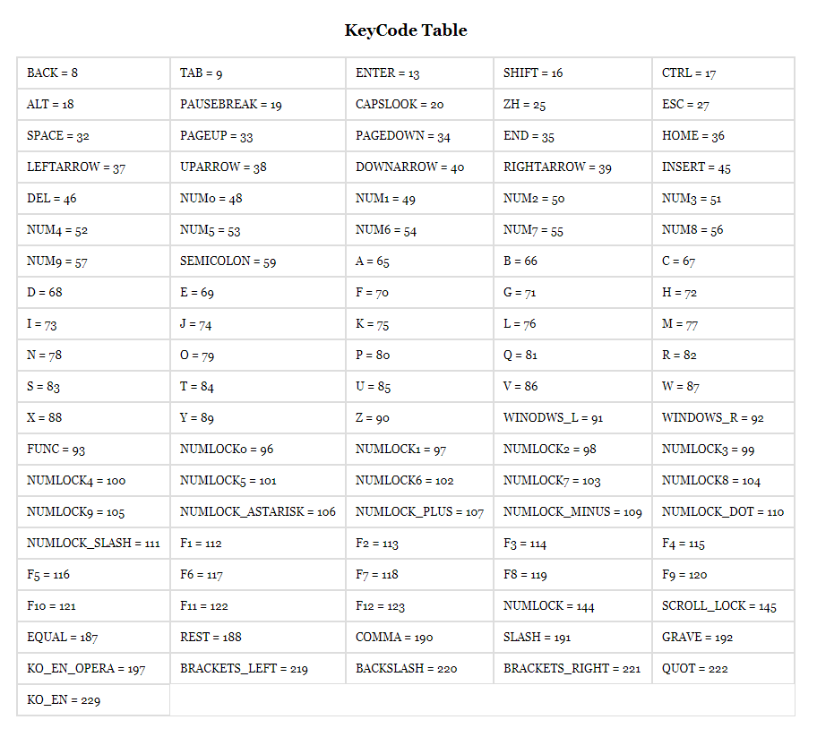

# KeyCodeTools
It is an open source Javascirpt for defining API KeyCode values constantly and providing an API that can group KeyCodes and distinguish between numbers and characters.

## KeyCode Table
<!-- HTML CODE-->
<div>

</div>

## Getting Started
### Install
Add the `keycode_tools.js` file in the `dist` folder to the useable html.

#
### Add the `KeyCodeTools` object
By default, `KeyCodeTools` is added to the `window` object.
```js
console.log(window.KeyCodeTools);
```
You can also use the `KeyCodeTools` object by adding it to the desired object in your app.
```js
app.keycodetools = window.KeyCodeTools;
```

## Attributes
### KeyCode
It is defined in [KeyCode Table](#keycode-table).
#### Ex)
```js
console.log(window.KeyCodeTools.KeyCode.BACK);
console.log(window.KeyCodeTools.KeyCode.NUM1);

result = 8
result = 49
```
### tools
#### checkInputBasic

#### checkSpecialCharacter

#### checkNumber

#### checkAlphabet

#### checkInputNumber

#### checkInputCharacter

#### checkEnter

## Example
You have created an example source in [`keycode_example.html`](./keycode_example.html).

